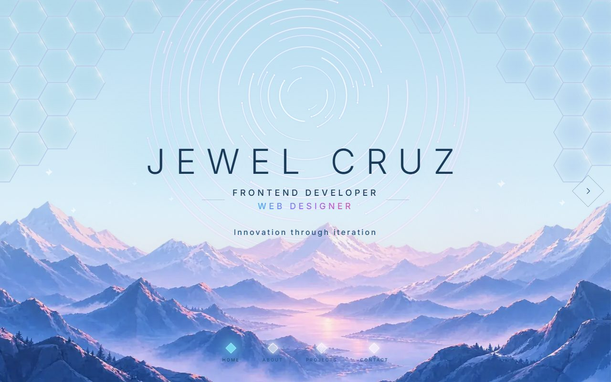
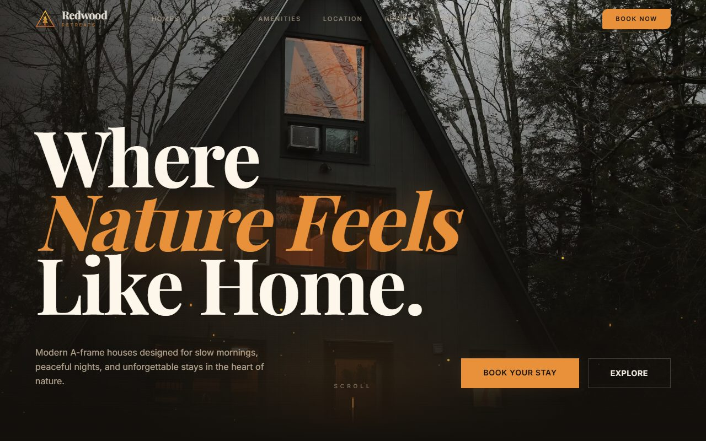
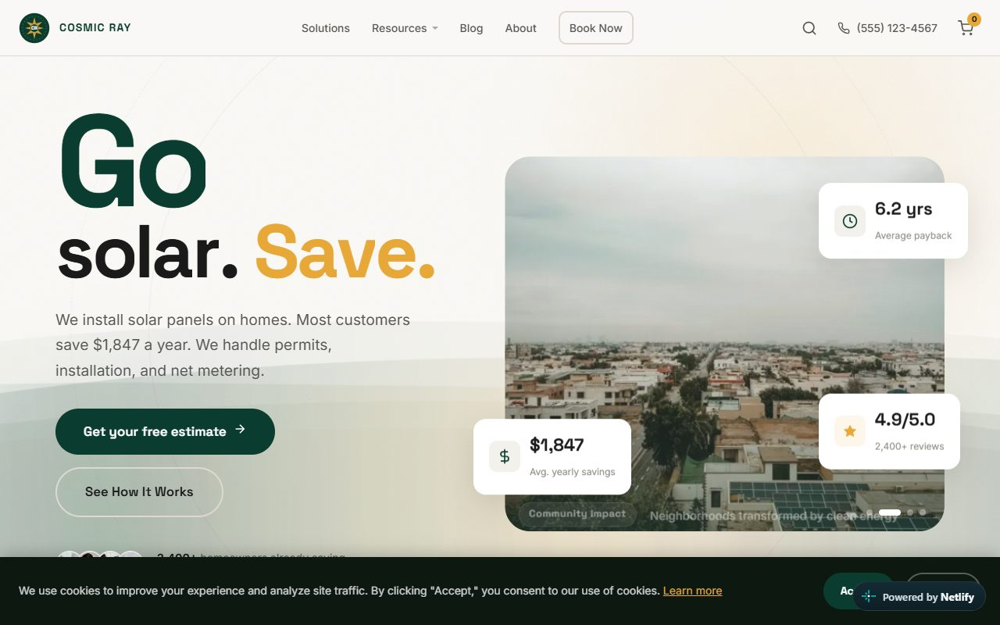
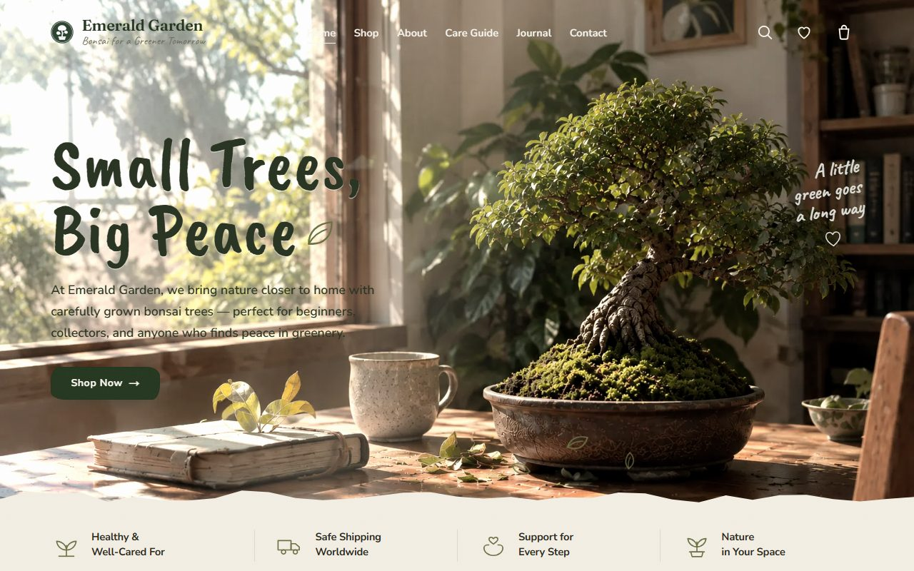
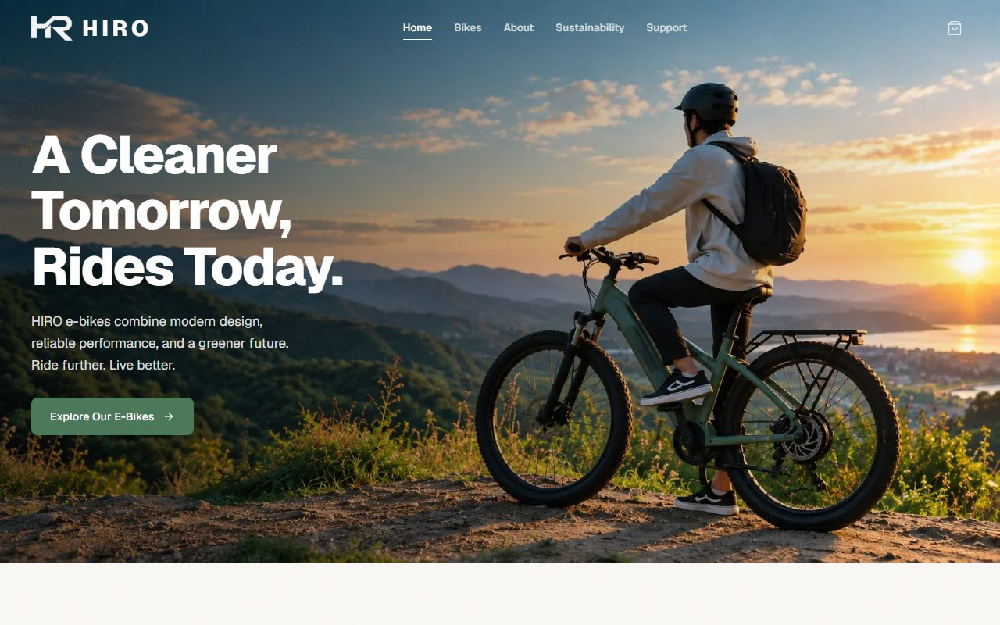
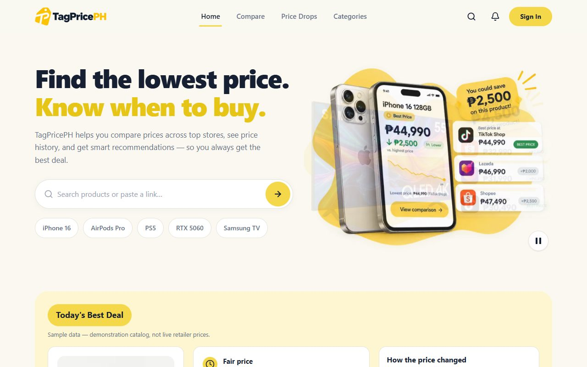
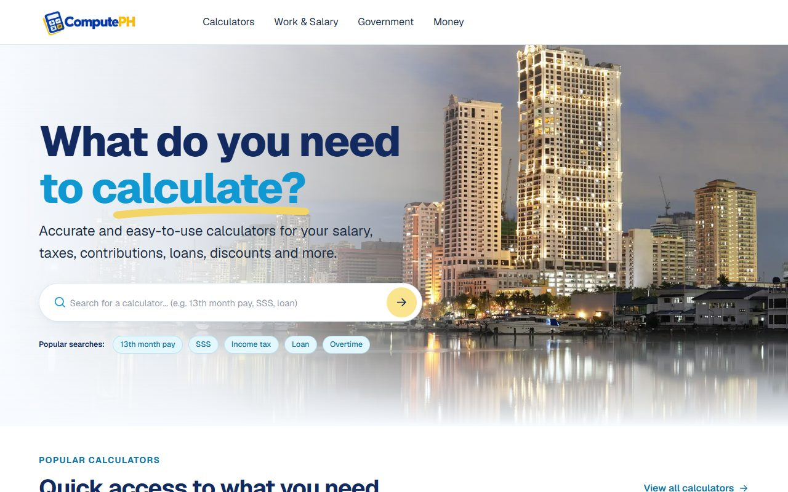

# Hi, I'm Jewel 

Frontend developer and web designer from the Philippines. I build fast, accessible, production-minded web apps with **Next.js, React, and TypeScript** — and I care a lot about performance, SEO, and the details users never see.

- 🌐 Portfolio — [portfolio-flame-eta-50.vercel.app](https://portfolio-flame-eta-50.vercel.app/)
- 💼 LinkedIn — [linkedin.com/in/jewel-cruz-396834439](https://www.linkedin.com/in/jewel-cruz-396834439)
- 📧 Email — jewelcruzs0922@gmail.com
- 💻 GitHub — [@jewelcruzs0922-dev](https://github.com/jewelcruzs0922-dev)
- 📄 [Resume (PDF)](https://github.com/jewelcruzs0922-dev/Portfolio/raw/main/public/resume.pdf)

  
  
  
  
  
  
  

## Featured projects

| Project | What it is | Links |
| --- | --- | --- |
| **Portfolio** | Slide-based personal site with a custom canvas background. Lighthouse 100 / 100 / 100 / 100 on mobile (production build). Next.js 16 + Tailwind v4. | [live](https://portfolio-flame-eta-50.vercel.app/) · [code](https://github.com/jewelcruzs0922-dev/Portfolio) |
| **Redwood Retreats** | A-frame cabin rental site with a custom canvas grass animation and SSR-safe particles. Multi-filter listings, gallery lightbox, reservation demo. 41 tests. | [live](https://redwood-retreats.vercel.app) · [code](https://github.com/jewelcruzs0922-dev/redwood-retreats) |
| **Cosmic Ray Solar** | Multi-page solar installer site with a cart, quote estimator, blog, and 6 generated city pages. 59 unit tests + Playwright, CI, offline caching. | [live](https://cosmicray-solar.netlify.app) · [code](https://github.com/jewelcruzs0922-dev/cosmicray-solar) |
| **Emerald Garden** | Bonsai storefront: 10 SSG product pages, server-priced checkout, atomic stock reservation, bespoke design system. 57 Playwright tests, WCAG AA audit. | [live](https://emerald-garden.vercel.app) · [code](https://github.com/jewelcruzs0922-dev/emerald-garden) |
| **HIRO** | E-bike landing page: three-bike configurator, slide-over cart, simulated checkout. 48 unit tests + Playwright e2e, axe checks in GitHub Actions CI, Lighthouse 95. | [live](https://hiro-azurite2.vercel.app) · [code](https://github.com/jewelcruzs0922-dev/HIRO) |
| **TagPricePH** | Filipino price comparison platform: comparison UI, typo-tolerant search, price-history charts, token-gated admin on Neon Postgres (14 migrations). Marketplace adapters fail closed until an authorized feed is connected. 20 verification suites. | [live](https://tagpriceph.vercel.app) · [code](https://github.com/jewelcruzs0922-dev/TagPricePH) |
| **ComputePH** | Philippine salary and work calculators — 13th month pay, overtime, night differential. 12 calculator pages, 274 unit tests. | [live](https://computeph.vercel.app) · [code](https://github.com/jewelcruzs0922-dev/ComputePH) |

## Toolbox

`Next.js` · `React` · `TypeScript` · `Tailwind CSS` · `Node.js` · `Framer Motion` · `Canvas API` · `Vitest` · `Playwright` · `Sanity`

## A bit more

- I hold myself to **Core Web Vitals, WCAG AA, and strict TypeScript** by default.
- I write tests (100+ across projects), respect `prefers-reduced-motion`, and ship security headers.
- **Open to work:** frontend / UI roles (remote, part-time or full-time). Available 12:00 AM – 12:00 PM PH time (GMT+8).
